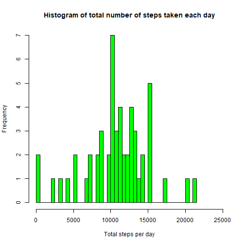
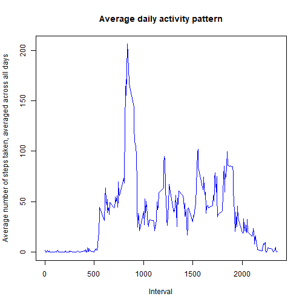
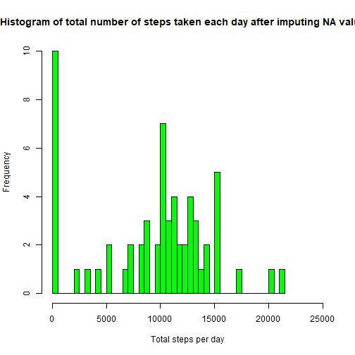
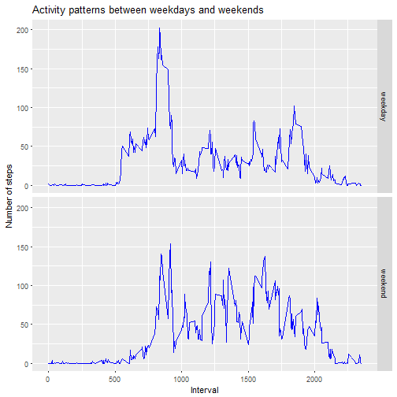

# Reproducible Research Peer Assessment 1: Personal Activity Monitoring Data Analysis

# Introduction
This assignment makes use of data from a personal activity monitoring device.
This device collects data at 5 minute intervals through out the day.
The data consists of two months of data from an anonymous individual collected
during the months of October and November, 2012 and include the number of steps
taken in 5 minute intervals each day.


# Loading and preprocessing the data


```r
library(knitr)
library(ggplot2)

activity_df<-read.csv("activity.csv")
```

# What is mean total number of steps taken per day?


### Histogram of the total number of steps taken each day


```r
tot_steps_per_day<-tapply(activity_df$steps,activity_df$date,sum)

hist(tot_steps_per_day,main="Histogram of total number of steps taken each day",xlab="Total steps per day",xlim=c(0,25000),col="green",breaks = 50)
```



### Mean and median number of steps taken each day


```r
mean(tot_steps_per_day,na.rm=TRUE)
```

```
## [1] 10766.19
```

```r
median(tot_steps_per_day,na.rm=TRUE)
```

```
## [1] 10765
```

# What is the average daily activity pattern?


```r
activity_na_omit_df<-subset(activity_df,is.na(steps) == FALSE,select = c(steps,date,interval))

unique_interval<-unique(activity_na_omit_df$interval)

avg_steps_per_interval<-tapply(activity_na_omit_df$steps,activity_na_omit_df$interval,mean)

avg_steps_df<-data.frame(interval=unique_interval,avg_steps=avg_steps_per_interval)
```
### Time series plot of the 5-minute interval (x-axis) and the average number of steps taken, averaged across all days (y-axis)


```r
plot(avg_steps_df$interval,avg_steps_df$avg_steps,main="Average daily activity pattern",xlab="Interval",ylab="Average number of steps taken, averaged across all days",type="l",col="blue")
```



### 5-minute interval with the maximum number of steps


```r
avg_steps_df[avg_steps_df$avg_steps==max(avg_steps_df$avg_steps),]$interval
```

```
## [1] 835
```

# Imputing missing values

### Total number of missing values in the dataset


```r
nrow(subset(activity_df,is.na(steps) == TRUE | is.na(date)== TRUE | is.na(interval)== TRUE ))
```

```
## [1] 2304
```
### Filling in the missing values in the dataset.


```r
activity_na_df<-subset(activity_df,is.na(steps) == TRUE,select = c(steps,date,interval))

avg_steps_per_date<-tapply(activity_na_omit_df$steps,activity_na_omit_df$date,mean)
```
### Finding the daily average number of steps


```r
daily_avg_steps<-mean(avg_steps_per_date,na.rm=TRUE)
```
### Finding the average number of steps for 5 min interval


```r
five_min_avg_steps <- daily_avg_steps/288
```
Imputing the missing vales with 5 min interval average number of steps


```r
avg_steps_per_date[is.na(avg_steps_per_date) == TRUE]<-five_min_avg_steps

unique_date<-unique(activity_df$date)

steps_date_df<-data.frame(avg_steps=avg_steps_per_date,date=unique_date)

activity_na_impute_df<-merge(activity_na_df,steps_date_df,by="date")

activity_na_impute_df<-subset(activity_na_impute_df,select=c(avg_steps,date,interval))

names(activity_na_impute_df)[names(activity_na_impute_df)=='avg_steps']<-'steps'
```

Create a new dataset that is equal to the original dataset but with the missing data filled in.


```r
activity_full_df<-rbind(activity_na_omit_df,activity_na_impute_df)
```
### Histogram of the total number of steps taken each day based on the new data set( no NA values)


```r
tot_steps_per_day_new<-tapply(activity_full_df$steps,activity_full_df$date,sum)

hist(tot_steps_per_day_new,main="Histogram of total number of steps taken each day after imputing NA values ",xlab="Total steps per day",xlim=c(0,25000),col="green",breaks = 50)
```



### Mean and median number of steps taken each day based on the new data set( no NA values)


```r
mean(tot_steps_per_day_new,na.rm=TRUE)
```

```
## [1] 9359.132
```

```r
median(tot_steps_per_day_new,na.rm=TRUE)
```

```
## [1] 10395
```

# Are there differences in activity patterns between weekdays and weekends?

### Create a new factor variable in the dataset with two levels weekday and weekend


```r
activity_full_df$date_type<-factor(sapply(weekdays(as.Date(activity_full_df$date)),switch,"Monday"="weekday","Tuesday"="weekday","Wednesday"="weekday","Thursday"="weekday","Friday"="weekday","Saturday"="weekend","Sunday"="weekend"),levels=c("weekday","weekend"))
```
### Panel plot containing a time series plot of the 5-minute interval (x-axis) and the average number of steps taken, averaged across all weekday days or weekend days (y-axis).


```r
g <- ggplot(activity_full_df,aes(interval,steps))

g + stat_summary(fun.y=mean, geom="line", color="blue", aes(group = date_type)) + facet_grid(date_type ~ .) + labs(x= "Interval", y= "Number of steps" , title="Activity patterns between weekdays and weekends")
```



